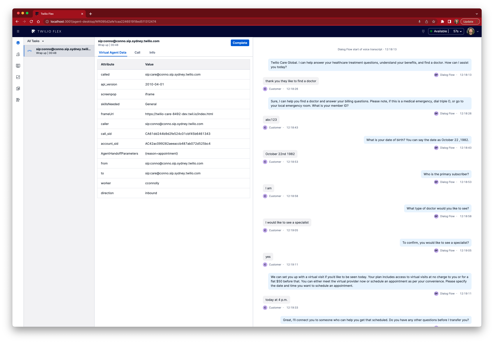
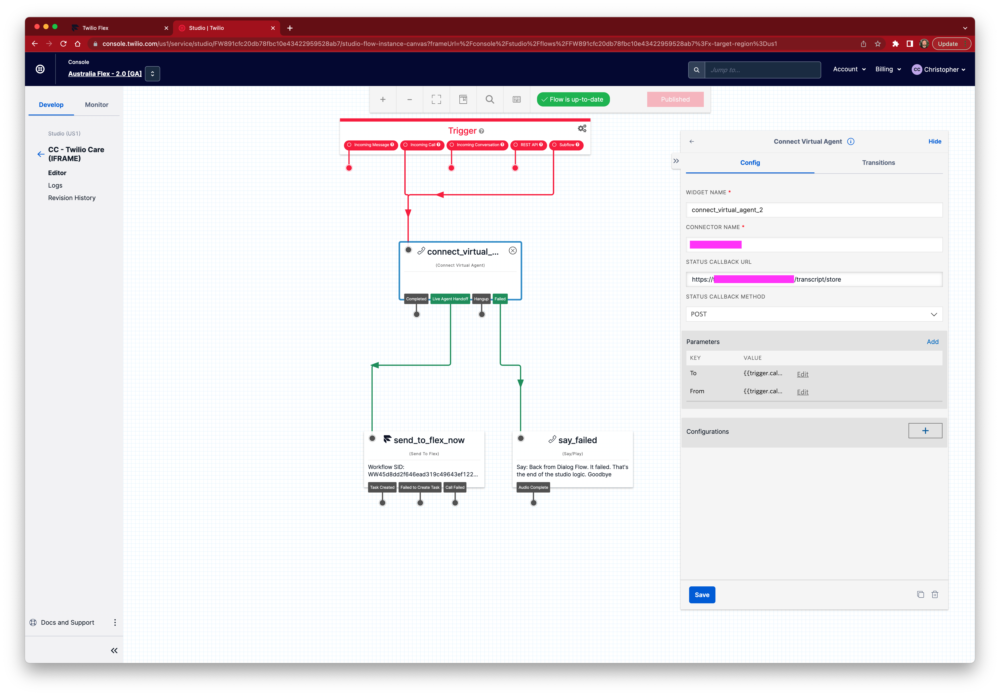
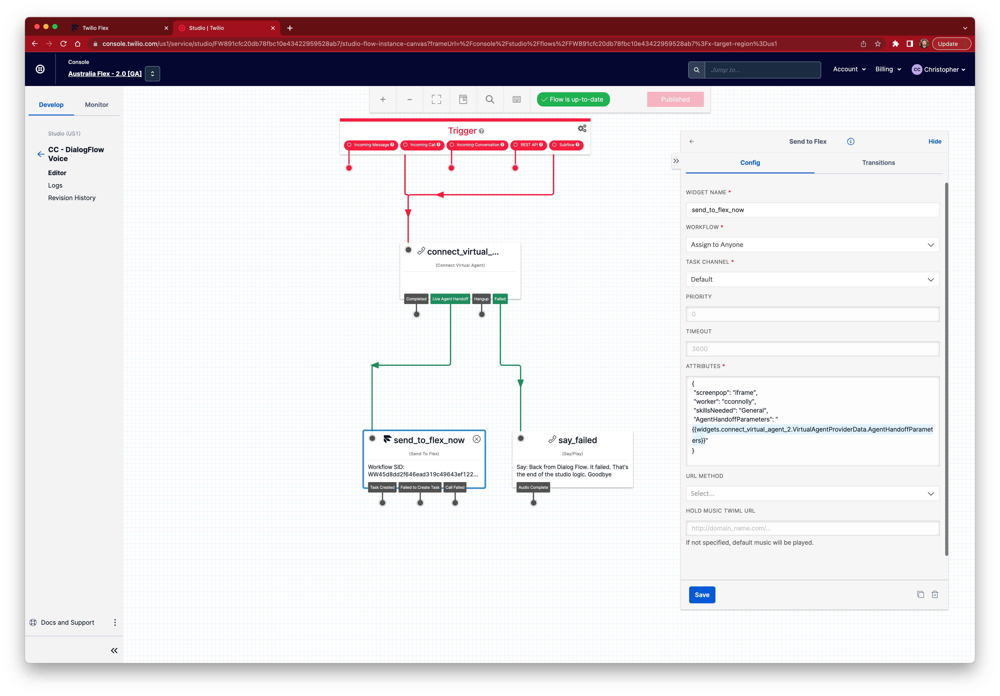

# Twilio Flex + DialogFlow Voice

🍭 Flex plugin to show DialogFlow Voice transcript in Flex

Virtual agent status events are streamed to serverless function that stores the transcript in a sync document.   Left for the reader:  This could also use Conversation API to store a conversation.

**_Features:_**

- 🌟 Display virtual agent transcript between caller and bot in Panel 2 (Dialogflow CX)
- 🌟 Display attached data in the task tab
- 🌟 Support for localisation (English, Japanese)
- 🌟 Native Paste UI for chat dialog (supports themes)





# Deployment
This project is structured with two top level directories, one for the Flex Plugin and the other for the Serverless application.

The serverless application is responsible for receiving events from the Twilio Virtual Agent (e.g. DialogFlow) and storing the response in an ordered Sync List using the CallSid as the key.  The Sync list is appended to each time a new event arrives. The serverless application is also responsible for providing the transcript to the Flex desktop.

The Flex plugin references the CallSid to lookup the transcript from the serverless function, and in turn the Sync List.


## Serverless App
1. In Twilio Console, create a new Sync Service, note the SID
2. In the `serverless/.env` folder configure the `TRANSCRIPT_SYNC_SERVICE_SID` with the newly created Sync Service SID
3. Deploy the serverless function with `twilio serverless deploy`
4. Take note of the deployment domain, this will be used in the next step when deploying Flex

## Flex
Note to add a new language see below **before** deploying
1. In the `flex-plugin/.env` folder configure the `REACT_APP_TRANSCRIPT_SERVICE_API_BASE` with the base URL created above
2. Deploy the Flex plugin with `twilio plugins flex deploy`


## Flex Localisation

### Customise a language
This project uses simple i18n for language translation.  Language files are located in `flex-plugin/src/languages/<locale>/common.js` where `<locale>` is a browser returned language code.

For example, the following is a translation to Japanese:
```json
  "transcript": {
    "customer": "お客様",
    "bot-name": "Dialogflow ボット",
    "transcript-start": "音声文字起こしの開始",
    "said-by-customer": "顧客が言った",
    "said-by-bot": "ボットが言った",
    "end-message": "DialogFlow ボットの終了"
  }
```

### Add a language
After adding a language file (see above), edit the `FlexDialogflowVoicePlugin.tsx`:
1. Import the newly created language file
2. Add the language to `langData`


``` ts
import translation_en_us from "./languages/en-US/common.json";
import translation_ja_jp from "./languages/ja-JP/common.json";
```

```ts
    const langData = {
      "en-US": translation_en_us,
      "ja-JP": translation_ja_jp,
    };
```

## Configuring Studio Flow

After configuring Studio for Dialog flow following [on boarding guide here](https://www.twilio.com/docs/voice/virtual-agent/dialogflow-cx-onboarding), add the following:
- Set the _Status Callback URL_ to the URL of previously deployed serverless endpoint e.g. `https://<domain>.twil.io/transcript/store`
- In the _Send to Flex_ widget set the attribute `AgentHandoffParameters` to a value simlar to `{{widgets.connect_virtual_agent_1.VirtualAgentProviderData.AgentHandoffParameters}}` where `connect_virtual_agent_1` is the name of the widget in your flow





